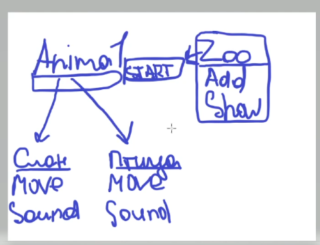

Практика: ООП принципы в Java

Необходимо записать экран с решением и и прислать в форме сдачи задания видеозапись
Задачи для практики (с учётом текущего уровня)

Спроектируйте задачи в Java, подбирая нужные конструкции.

1. Зоопарк
   В зоопарке есть разные животные, каждое из которых издаёт уникальные звуки и передвигается своим способом. Например, слон трубит и ходит, а птица чирикает и летает. Нужно спроектировать систему, которая может работать с любыми животными, добавлять их в зоопарк, а затем показывать, как они издают звуки и передвигаются.

2. Задача: Управление домашними питомцами
   В системе есть разные виды домашних питомцев, каждый из которых требует уникального ухода. Например:
   Собака гуляет и ест сухой корм.
   Кошка играет и ест влажный корм.
   Нужно спроектировать систему, которая принимает любого питомца и позволяет взаимодействовать с ним (например, кормить, выгуливать или играть), с учётом особенностей каждого вида.

3. Задача: Управление рестораном
   В ресторане есть разные блюда, каждое из которых имеет свои особенности. Например:
   Горячее блюдо подаётся с указанием температуры.
   Напиток подаётся с указанием объёма.
   Нужно спроектировать систему, которая позволяет добавлять блюда в меню ресторана и выводить их описание с учётом специфичных характеристик (например, температура для горячих блюд или объём для напитков).

4. Образовательная платформа
   На образовательной платформе есть курсы, студенты и преподаватели. Студенты могут учиться на курсах, а преподаватели проверяют их задания. Нужно спроектировать систему, которая добавляет студентов и преподавателей на курс, позволяет студентам учиться и фиксировать их прогресс, а преподаватели могут проверять задания студентов.

5. Библиотека
   В библиотеке есть книги и читатели. Читатели могут брать книги из библиотеки и возвращать их. Нужно спроектировать систему, которая управляет списком доступных книг, уменьшает количество книг при их выдаче и увеличивает при их возврате. Также система должна фиксировать, какие читатели берут или возвращают книги.